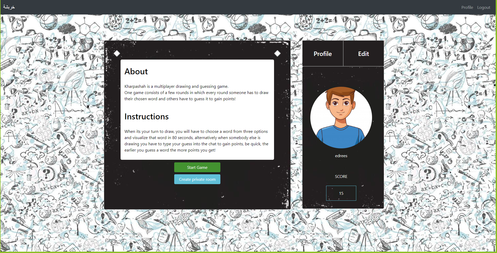
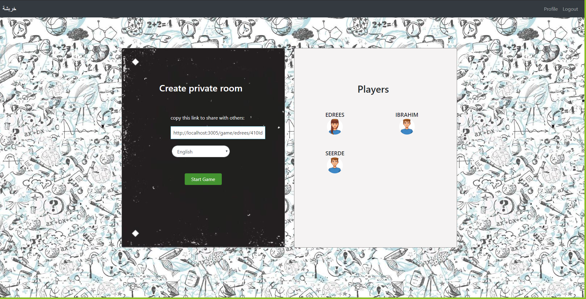
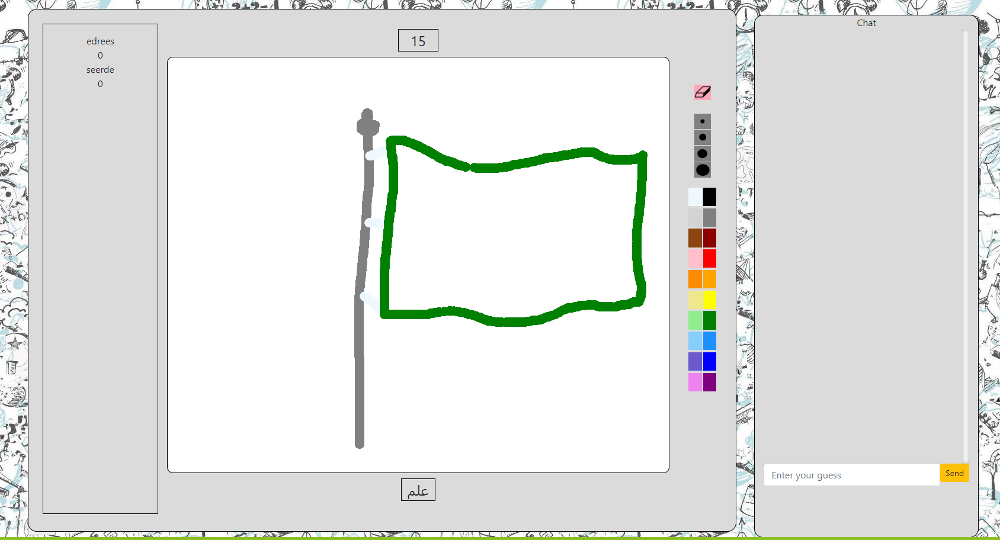

# kharbsha

### [link to the Web App](https://kharbsha.herokuapp.com)

## Description

##### Project Name

kharbsha (خربشة)

##### Overview:

kharbsha is a multiplayer drawing and guessing game.
One game consists of a few rounds in which every round someone has to draw their chosen word and others have to guess it to gain points!
The person with the most points at the end of game will then be crowned as the winner!

##### Prototype:

### https://xd.adobe.com/view/f9e94755-a107-47f2-5eff-8026c76a7639-8fd8/

##### Technical Used:

The website is connected to our online Database on MongoDb which all user data is stored and English & Arabic list of words (API). A Full Stack MERN website:

- MongoDB, Mongoose
- Express
- REACT
- Node.js
- P5
- Firebase realtime database
- custom API
- Bootstrap

##### Packages Used:

admin-bro, admin-bro-expressjs, admin-bro-mongoose, axios, bcrypt, bcryptjs, bootstrap,
cookie-parser, cors, express, express-formidable, express-session, jsonwebtoken, jwt decode, mongoose, mongoose-autopopulate, react-bootstrap, firebase, jquery, p5, react-dom, react-scripts.

##### User Stories:

- User can be able to Create an account and login.
- User can be able to view the home page.
  
- User can be able to create a private room to invite specific players.
  
- User can be able to view personal profile and score.
- User can be able to Edit profile.
- User has a turn to draw a chosen word from three options and visualized it in a specific time.
- User can type his/her guess into the chat box to gain points.
  

##### Future improvements

- Users can join random open sessions.
- Host can add a custom word list.
- More design for the game page.

##### Team members:

- Edrees Alyamani
- Ibrahim Ahmed
- Ibtihal Alotaibi
- Halah Al-yanbawi
